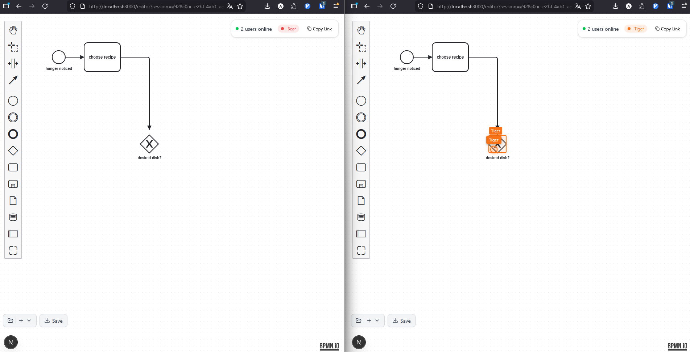

# BPMN Editor

Real-time collaborative BPMN editor with WebSocket-based synchronization.



## Quick Start

```bash
docker-compose up --build
```

Open <http://localhost:3000> in your browser.

For local development, see `frontend/README.md` and `backend/README.md`.
